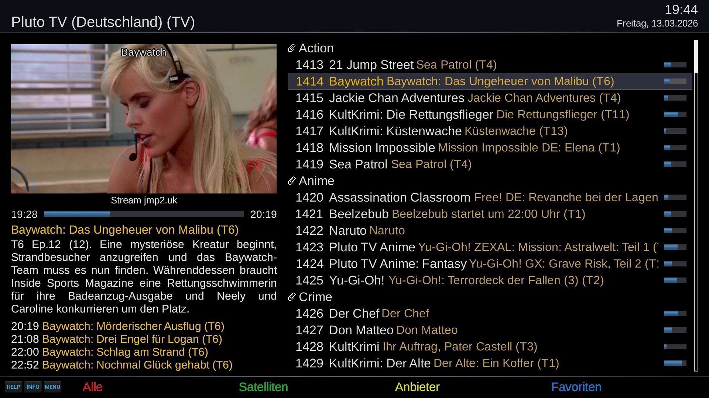
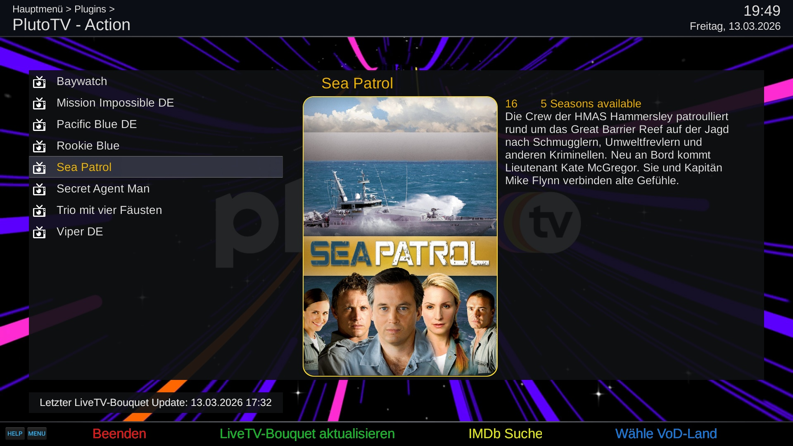

# Pluto-TV (PTV)
Open-Enigma2 plugin for PlutoTV Live-TV and VoD streams

## Live-TV

## Video-On-Demand

## Features
- Playback of PlutoTV channels by country

## Limitations
- Pluto-TV supports OpenViX and compatible Open Enigma2 distributions.

## Languages
- english
- german
- finnish (by Orlandoxx)
- spanish (by Huevos)

## Links
- Installation: https://opencockpit.github.io/PlutoTV
